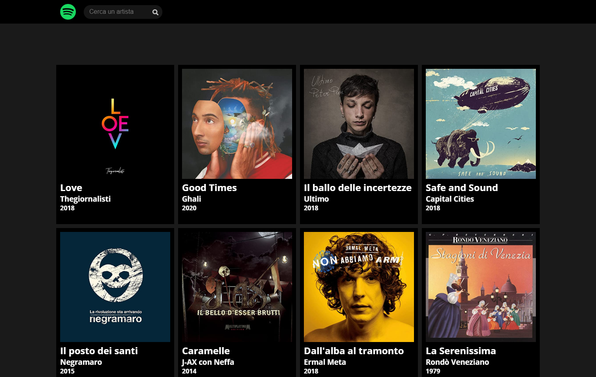

# php-ajax-dischi **:open_file_folder:**

:man_student:--Task:

**Millestone 1**

- Stampare a schermo una decina di dischi musicali (vedi grafica allegata sotto).
- Utilizzare solo PHP per ora e non AJAX.
- Stampa direttamente i dischi in pagina: al caricamento della pagina ci saranno tutti i dischi.
- Utilizzare Html, Sass e PHP.
- Scegliete pure le immagini che volete utilizzare.

**Milestone 2**

- Creare un altra pagina index-ajax.php, appunto per la versione AJAX dell’esercizio.
- Attraverso l’utilizzo di AJAX: al caricamento della pagina ajax chiederà attraverso una chiamata i dischi a php e li stamperà attraverso handlebars.

**Optional**

- Attraverso un’altra chiamata ajax, filtrare gli album per artista.

  

 ​ ​ :desktop_computer: Project Preview:

 ​ ​ ​ ​ ​ ​ ​ ​ ​ ​ ​ ​ ​ ​ ​ ​ ​ ​ ​ ​ ​ ​ ​ ​ 

#

 ​ ​ ​ ​ ​ ​ ​ ​ ​ ​ ​ ​ ​ ​ ​ ​ ​ ​ ​ ​ ​ ​ ​ ​ ​ ​ ​ ​ ​ ​ ​ ​ ​ ​ ​ ​ ​ ​ ​ ​ ​ ​ ​ ​ ​ ​ ​ ​ ​ ​ ​ ​ ​ ​ ​ ​ ​ ​ ​ ​ ​ :eyes: Visit My Github Profile to see other [__Project__](https://github.com/Vincenzo-Laveneziana?tab=repositories):man_technologist: 
#

